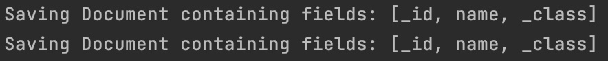

# Introduction

When we work in project based on [Spring Framework](https://spring.io/projects/spring-framework) and need to access
database we will probably use [Spring Data](https://spring.io/projects/spring-data) for this.

One of the benefits of this approach is that we can only configure connection to database (e.g. in properties) and then
just create `Bean` of interface implementing `Repository`, `CrudRepository` or `PagingAndSortingRepository`.
This interfaces provides us magically methods to operate on our database.

For example `CrudRepository` will provide us implementation to all methods
declared [here](https://docs.spring.io/spring-data/commons/docs/current/api/org/springframework/data/repository/CrudRepository.html)
operating on database which we chose.

Are such auto-generated methods are flawless? No! And I will show you why on specific example.

# Example MongoDB repository

## What is `MongoRepository`?

In `spring-boot-data-mongodb` project we can find additional `Repository` interface named
[MongoRepository](https://docs.spring.io/spring-data/mongodb/docs/current/api/org/springframework/data/mongodb/repository/MongoRepository.html)
.
It is special interface for MongoDB with base implementation
[SimpleMongoRepository](https://docs.spring.io/spring-data/mongodb/docs/current/api/org/springframework/data/mongodb/repository/support/SimpleMongoRepository.html)
.

## Example collection

Let's assume we have project which stores books. Such project will store objects in MongoDB collection `books`.
Class definition for books will look like:

```kotlin
@Document(collection = "books")
data class Book(@Id val id: String? = null, val name: String)
```

If you wonder why `id` is nullable just wait a little 😉

For this collection we will define repository:

```kotlin
interface BooksRepository : MongoRepository<Book, String>
```

And that's it. Now we can use our new repository in project as Spring Bean.
We have methods like `save`, `find`, `delete`, `count` out of the box. Isn't that cool?

# Problem with `saveAll` method in `SimpleMongoRepository`

## `id` is essential!

Let's look at such two tests:

```kotlin
    @Test
fun shouldSaveBooks_WithoutId() {
  // GIVEN
  val books = listOf(
    Book(name = "bookName1"),
    Book(name = "bookName2")
  )

  // WHEN
  booksRepository.saveAll(books)

  // THEN
  assertEquals(booksRepository.findAll(), books)
}
```

```kotlin
    @Test
fun shouldSaveBooks_WithId() {
  // GIVEN
  val books = listOf(
    Book(id = "bookId1", name = "bookName1"),
    Book(id = "bookId2", name = "bookName2")
  )

  // WHEN
  booksRepository.saveAll(books)

  // THEN
  assertEquals(booksRepository.findAll(), books)
}
```

Similar, right?
The only difference is that in the second one we fill the `id` field before saving.

Let's look at the results of this tests.


Test in which we fill the ids passed. That because we compared whole objects.
When we leave ids as `null` MongoDB will set them itself. You can see it when we look at the assertion which failed.


It's clear. Each document needs an ID so MongoDB set it when necessary (more details about `_id`
field [here](https://www.mongodb.com/docs/manual/core/document/#the-_id-field)).

But there is one thing that surprises when we look at the application logs while executing the tests.
To see this we have to enable `DEBUG` logging on `MongoTemplate`
(add `logging.level.org.springframework.data.mongodb.core.MongoTemplate=DEBUG` in `application.properties`).

Test in which we set ids ourselves generates two queries into database (`saves`):


And test without ids generates only one query into database (`insert`):


Why is that?

## `saveAll` exposed.

```java
  /*
 * (non-Javadoc)
 * @see org.springframework.data.mongodb.repository.MongoRepository#saveAll(java.lang.Iterable)
 */
@Override
public<S extends T> List<S> saveAll(Iterable<S> entities){

  Assert.notNull(entities,"The given Iterable of entities not be null!");

  Streamable<S> source=Streamable.of(entities);
  boolean allNew=source.stream().allMatch(entityInformation::isNew);

  if(allNew){

  List<S> result=source.stream().collect(Collectors.toList());
  return new ArrayList<>(mongoOperations.insert(result,entityInformation.getCollectionName()));
  }

  return source.stream().map(this::save).collect(Collectors.toList());
  }
```

This is body of the `saveAll` method from `SimpleMongoRepository`.
When all entities are new (checking the `id`), all of them are collecting to list and save using one `insert` method.
Otherwise, each entity is `save` separately.

Why is that?

Because when we not fill the `_id` field it means that all documents should be inserted without collision to any existing one.

But when we fill the `_id` there may be a situation that document with such ID already exists.
Then what?
We will insert new document or update existing one.

MongoDB does not provide method for saving all given documents.
We can use only [insert](https://www.mongodb.com/docs/v4.4/reference/method/db.collection.insert/),
[insertMany](https://www.mongodb.com/docs/v4.4/reference/method/db.collection.insertMany/)
or [save](https://www.mongodb.com/docs/v4.4/reference/method/db.collection.save/).
That's why `saveAll` method in `MongoRepository` has such logic.
It covers something that we may want to use in our service but it is not available in MongoDB itself.

## How does it affect performance?

Let's create two more tests to see how it affects performance.
Similar as above, we will create tests with and without ids, but this time we will save 10,000 books.
So, the tests will look like:

```kotlin
    @Test
fun shouldSaveTenThousandOfBooks_WithoutId() {
  // GIVEN
  val books = (1..10_000)
    .map { Book(name = "bookName$it") }

  // WHEN
  booksRepository.saveAll(books)

  // THEN
  assertEquals(booksRepository.count(), 10_000)
}
```

```kotlin
    @Test
fun shouldSaveTenThousandOfBooks_WithId() {
  // GIVEN
  val books = (1..10_000)
    .map { Book(id = "bookId$it", name = "bookName$it") }

  // WHEN
  booksRepository.saveAll(books)

  // THEN
  assertEquals(booksRepository.count(), 10_000)
}
```

What are the test results?


Of course both tests passed, because we only checked count of saved objects.

But look at the execution times...

----

**🚨 Saving books without id took 560ms and with id 17 sec 197 ms. 🚨**

**🚨 That's about 30 times more! 🚨**

----

This is a really significant difference, especially in online systems.

## Example case when this can cause a problem

Suppose you are creating a service that imports flat files (csv, xlsx) into the database.
The application receives the file, has to read all the lines, map the data and save it in the database.

The time to load a single file (and the database load) will be significantly greater if you give each document `_id` immediately in the service when
mapping data.

For files with thousands of lines, you will run thousands of database queries instead of one.

Complaints from admins about the slow-running system guaranteed 😉

# Conclusion

1. When it is possible, avoid setting `_id` manually in code using `saveAll` method from `MongoRepository`.


2. Abstractions which "do the magic stuff" to make our coding simpler is usually awsome but sometimes it can be a burden.

