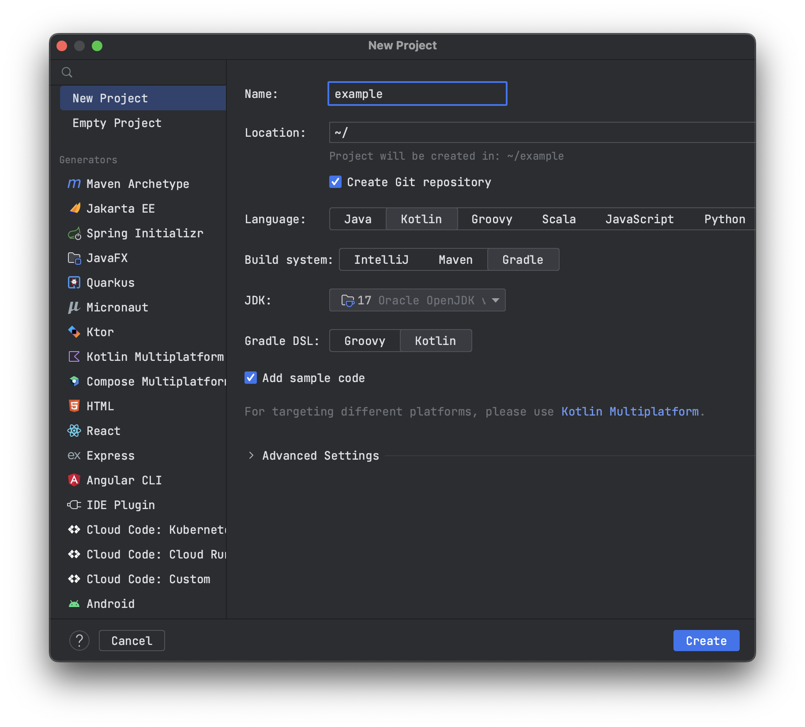

# Introduction

Do you want to start using [Apache Spark](https://spark.apache.org/) from the basics?
Or you already use it and want to write jobs in Kotlin with Gradle.

In this post, I will show you how to
create [example Spark-Kotlin-Gradle project](https://github.com/jakubpradzynski/example-spark-kotlin-gradle-project) from which you can start further
work with [Apache Spark](https://spark.apache.org/).

If you need a ready-to-use project, there is one available on my
GitHub [here](https://github.com/jakubpradzynski/example-spark-kotlin-gradle-project).

# Example Spark-Kotlin-Gradle project

## Generating project

Initially, I generated the project using IntelliJ IDEA (File > New > New project).

Selected:

- Language: Kotlin
- Build system: Gradle
- JVM: 17
- Gradle DSL: Kotlin



## Dependencies

In such generated project, you need to define dependencies for Apache Spark and Kotlin API.

```kotlin
dependencies {
  compileOnly("org.apache.spark:spark-sql_2.13:3.3.1") // Apache Spark 3.3.1 for Scala 2.13
  implementation("org.jetbrains.kotlinx.spark:kotlin-spark-api_3.3.1_2.13:1.2.3") // Spark Kotlin API 1.2.3 for Apache Spark 3.3.1 (and Scala 2.13)
  implementation("com.fasterxml.jackson.core:jackson-core:2.14.2") // Required for proper work by other dependencies
  testImplementation("io.kotest:kotest-runner-junit5:5.5.5") // Kotest library for tests
  testImplementation("io.kotest:kotest-assertions-core:5.5.5") // Kotest assertions for tests
}
```

You also have to add a plugin:

```kotlin
plugins {
  id("com.github.johnrengelman.shadow") version "7.1.2"
}
```

Which allows you to build fat jar with all required dependencies.
May be required to enable the option:

```kotlin
tasks.shadowJar {
  isZip64 = true
}
```

Because of the size of the jar.

With all those dependencies, you will be ready to execute your job.

## Example job

### Code

To see if it works, you can create a simple job like this:

```kotlin
import org.jetbrains.kotlinx.spark.api.dsOf
import org.jetbrains.kotlinx.spark.api.reduceK
import org.jetbrains.kotlinx.spark.api.withSpark
import java.io.Serializable
import java.math.BigDecimal
import java.math.RoundingMode.HALF_EVEN
import kotlin.random.Random

fun main(args: Array<String>) {
  withSpark(appName = "Example Spark-Kotlin-Gradle project") {
    println("Staring example Kotlin-Spark project")
    println("Program arguments: ${args.joinToString()}")
    val randomPrices = (0..args.first().toInt())
      .map { Price(randomBigDecimal()) }
      .toTypedArray()
    spark
      .dsOf(*randomPrices)
      .reduceK { price, price2 -> Price(price.priceInDollars + price2.priceInDollars) }
      .let { println("Sum of random prices: ${it.priceInDollars.setScale(2, HALF_EVEN)}$") }
  }
}

private fun randomBigDecimal() = Random.nextDouble(0.0, 99.99).toBigDecimal()

data class Price(val priceInDollars: BigDecimal) : Serializable {
  operator fun plus(secondSummand: Price): Price {
    return Price(this.priceInDollars + secondSummand.priceInDollars)
  }
}
```

As you can see, it's a standard Kotlin main function with arguments.

It runs Apache Spark using the `withSpark` function. It accepts everything that you may need to run Apache Spark.
Inside, you can use App arguments and refer to the `spark` object.

This job:

- takes the first parameter as a number of randomly generated prices
- creates `Dataset` from those prices
- sums all prices using Spark into one variable
- prints the result

### Test

I overwrite the `+` operator for summing two `Price` objects to show you that it is possible to write tests for it.
To check if it's the correct implementation I created a test for it in Kotest:

```kotlin
import io.kotest.core.spec.style.ShouldSpec
import io.kotest.matchers.shouldBe
import java.math.BigDecimal

class PriceTest : ShouldSpec({
  should("sum two prices") {
    // GIVEN
    val firstPriceInBigDecimal = BigDecimal.ONE
    val secondPriceInBigDecimal = BigDecimal.TEN
    val firstPrice = Price(firstPriceInBigDecimal)
    val secondPrice = Price(secondPriceInBigDecimal)

    // WHEN
    val priceSum = firstPrice + secondPrice

    // THEN
    priceSum.priceInDollars shouldBe (firstPriceInBigDecimal + secondPriceInBigDecimal)
  }
})
```

It's also possible to write a test for code running on Spark, but it's beyond the scope of this post.

## Execute the job

### Command line

To run the job from the command line, you have to build the previously mentioned shadow jar:

```shell
./gradlew shadowJar
```

After that, you can run it with the `"10"` argument using the command:

```shell
java -XX:+IgnoreUnrecognizedVMOptions \
  --add-opens=java.base/java.lang=ALL-UNNAMED \
  --add-opens=java.base/java.lang.invoke=ALL-UNNAMED \
  --add-opens=java.base/java.lang.reflect=ALL-UNNAMED \
  --add-opens=java.base/java.io=ALL-UNNAMED \
  --add-opens=java.base/java.net=ALL-UNNAMED \
  --add-opens=java.base/java.nio=ALL-UNNAMED \
  --add-opens=java.base/java.util=ALL-UNNAMED \
  --add-opens=java.base/java.util.concurrent=ALL-UNNAMED \
  --add-opens=java.base/java.util.concurrent.atomic=ALL-UNNAMED \
  --add-opens=java.base/sun.nio.ch=ALL-UNNAMED \
  --add-opens=java.base/sun.nio.cs=ALL-UNNAMED \
  --add-opens=java.base/sun.security.action=ALL-UNNAMED \
  --add-opens=java.base/sun.util.calendar=ALL-UNNAMED \
  --add-opens=java.security.jgss/sun.security.krb5=ALL-UNNAMED \
  -jar build/libs/example-spark-kotlin-gradle-project-1.0-SNAPSHOT-all.jar 10
```

All `--add-opens` are required when using Java 17 (
see [JavaModuleOptions](https://github.com/apache/spark/blob/v3.3.0/launcher/src/main/java/org/apache/spark/launcher/JavaModuleOptions.java)).

If you want to use Java 8, you should change `jvmToolchain` version (in `build.gradle.kts`).

For Java 8 you can skip those options:

```shell
java -jar build/libs/example-spark-kotlin-gradle-project-1.0-SNAPSHOT-all.jar 10
```

### IntelliJ IDEA

You can also run it via IntelliJ IDEA. If you generate a project, you should have such a configuration ready to use.

The only thing you will have to change is to add all those ``--add-opens`` options in `VM options`.

## Output of the job

If everything goes well, running such a job should generate logs like the below:

```
WARNING: sun.reflect.Reflection.getCallerClass is not supported. This will impact performance.
Using Spark's default log4j profile: org/apache/spark/log4j2-defaults.properties
23/02/13 15:32:57 INFO SparkContext: Running Spark version 3.3.1
23/02/13 15:32:57 WARN NativeCodeLoader: Unable to load native-hadoop library for your platform... using builtin-java classes where applicable
23/02/13 15:32:57 INFO ResourceUtils: ==============================================================
23/02/13 15:32:57 INFO ResourceUtils: No custom resources configured for spark.driver.
23/02/13 15:32:57 INFO ResourceUtils: ==============================================================
23/02/13 15:32:57 INFO SparkContext: Submitted application: Example Spark-Kotlin-Gradle project
23/02/13 15:32:57 INFO ResourceProfile: Default ResourceProfile created, executor resources: Map(cores -> name: cores, amount: 1, script: , vendor: , memory -> name: memory, amount: 1024, script: , vendor: , offHeap -> name: offHeap, amount: 0, script: , vendor: ), task resources: Map(cpus -> name: cpus, amount: 1.0)
23/02/13 15:32:57 INFO ResourceProfile: Limiting resource is cpu
23/02/13 15:32:57 INFO ResourceProfileManager: Added ResourceProfile id: 0
23/02/13 15:32:57 INFO SecurityManager: Changing view acls to: jakub.pradzynski
23/02/13 15:32:57 INFO SecurityManager: Changing modify acls to: jakub.pradzynski
23/02/13 15:32:57 INFO SecurityManager: Changing view acls groups to:
23/02/13 15:32:57 INFO SecurityManager: Changing modify acls groups to:
23/02/13 15:32:57 INFO SecurityManager: SecurityManager: authentication disabled; ui acls disabled; users  with view permissions: Set(jakub.pradzynski); groups with view permissions: Set(); users  with modify permissions: Set(jakub.pradzynski); groups with modify permissions: Set()
23/02/13 15:32:57 INFO Utils: Successfully started service 'sparkDriver' on port 61440.
23/02/13 15:32:57 INFO SparkEnv: Registering MapOutputTracker
23/02/13 15:32:57 INFO SparkEnv: Registering BlockManagerMaster
23/02/13 15:32:57 INFO BlockManagerMasterEndpoint: Using org.apache.spark.storage.DefaultTopologyMapper for getting topology information
23/02/13 15:32:57 INFO BlockManagerMasterEndpoint: BlockManagerMasterEndpoint up
23/02/13 15:32:57 INFO SparkEnv: Registering BlockManagerMasterHeartbeat
23/02/13 15:32:57 INFO DiskBlockManager: Created local directory at /private/var/folders/yz/624nvk5d3nx111xksfv3b_vc0000gq/T/blockmgr-09e80830-9d54-4307-90a6-12a49829a298
23/02/13 15:32:57 INFO MemoryStore: MemoryStore started with capacity 4.6 GiB
23/02/13 15:32:57 INFO SparkEnv: Registering OutputCommitCoordinator
23/02/13 15:32:57 INFO Utils: Successfully started service 'SparkUI' on port 4040.
23/02/13 15:32:57 INFO Executor: Starting executor ID driver on host 192.168.1.35
23/02/13 15:32:57 INFO Executor: Starting executor with user classpath (userClassPathFirst = false): ''
23/02/13 15:32:57 INFO Utils: Successfully started service 'org.apache.spark.network.netty.NettyBlockTransferService' on port 61441.
23/02/13 15:32:57 INFO NettyBlockTransferService: Server created on 192.168.1.35:61441
23/02/13 15:32:57 INFO BlockManager: Using org.apache.spark.storage.RandomBlockReplicationPolicy for block replication policy
23/02/13 15:32:57 INFO BlockManagerMaster: Registering BlockManager BlockManagerId(driver, 192.168.1.35, 61441, None)
23/02/13 15:32:57 INFO BlockManagerMasterEndpoint: Registering block manager 192.168.1.35:61441 with 4.6 GiB RAM, BlockManagerId(driver, 192.168.1.35, 61441, None)
23/02/13 15:32:57 INFO BlockManagerMaster: Registered BlockManager BlockManagerId(driver, 192.168.1.35, 61441, None)
23/02/13 15:32:57 INFO BlockManager: Initialized BlockManager: BlockManagerId(driver, 192.168.1.35, 61441, None)
Staring example Kotlin-Spark project
Program arguments: 10
Sum of random prices: 664.77$
```

# Summary

That's it. Now you have prepared infrastructure to create more complex Apache Spark jobs (with Kotlin & Gradle).

For more information, I refer you to the documentation:

- [Apache Spark](https://spark.apache.org/)
- [Kotlin for Apache Spark](https://github.com/Kotlin/kotlin-spark-api)
- [Quick Start Guide](https://github.com/Kotlin/kotlin-spark-api/wiki/Quick-Start-Guide)
- [kotlin-spark-example](https://github.com/MKhalusova/kotlin-spark-example)
- [Kotest](https://kotest.io/)

I also encourage you to visit my blog regularly.
I will write more Apache Spark posts in the future, including how to deploy such a project on GCP.
